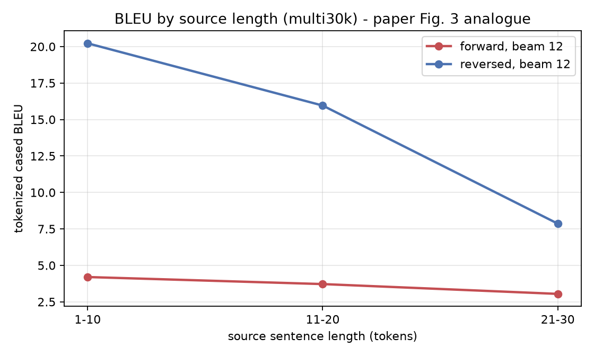
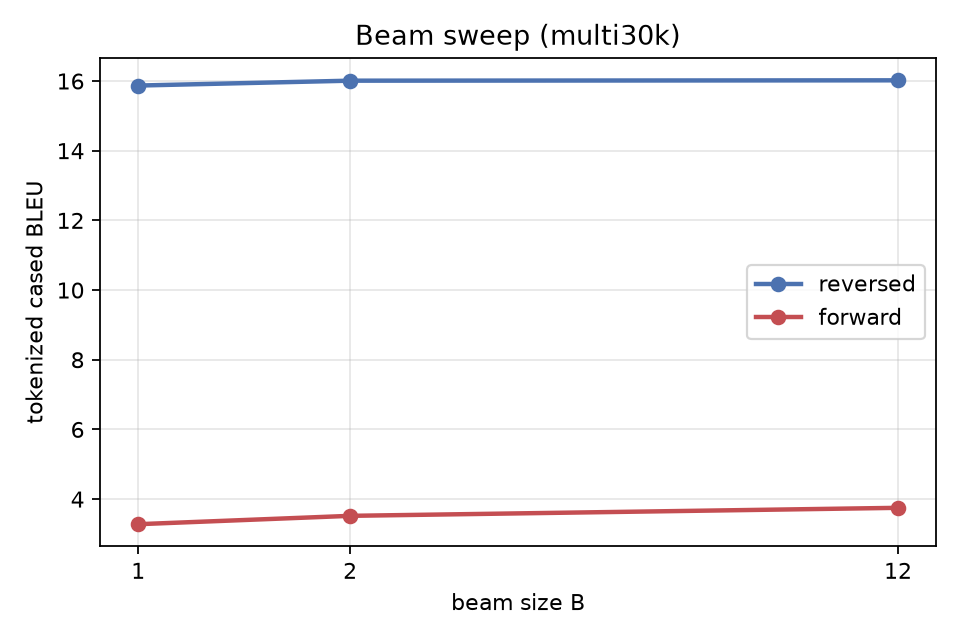
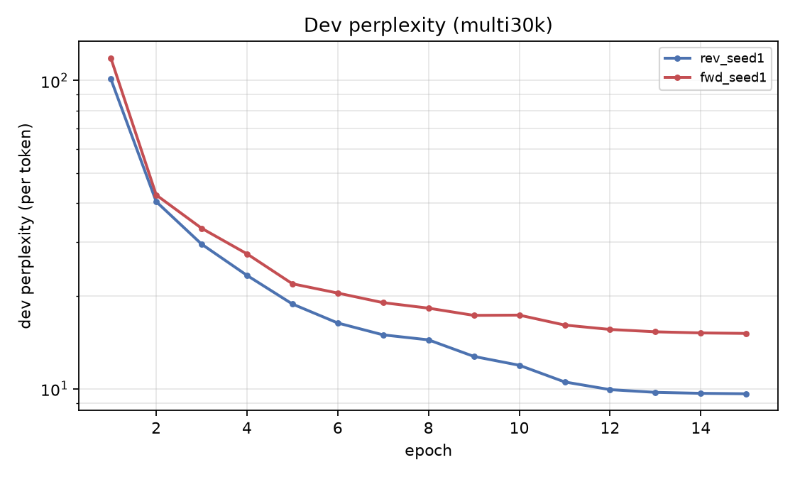

# Reproduction results - multi30k

> **Scale gap.** Multi30k (29k image captions), 2x256 LSTM. Pipeline validation and a seed-controlled ablation - NOT the paper's corpus or test set.

| Method | beam | our BLEU (tok, cased) | our BLEU (sacreBLEU detok) | our test ppl | paper BLEU |
|---|---|---|---|---|---|
| Single forward LSTM | 1 | **3.28** | 3.24 | 14.352 | - |
| Single forward LSTM | 2 | **3.52** | 3.48 | 14.352 | - |
| Single forward LSTM | 12 | **3.75** | 3.55 | 14.352 | 26.17 |
| Single reversed LSTM | 1 | **15.87** | 15.42 | 8.934 | - |
| Single reversed LSTM | 2 | **16.01** | 15.61 | 8.934 | - |
| Single reversed LSTM | 12 | **16.02** | 15.56 | 8.934 | 30.59 |

## The paper's central claim, at our scale

- BLEU (beam 12): forward **3.75** -> reversed **16.02** (**+12.27**); paper 26.17 -> 30.59 (+4.42).
- Test perplexity: forward **14.352** -> reversed **8.934**; paper 5.8 -> 4.7.
- Beam: B=1 15.87, B=2 16.01, B=12 16.02 - B=2 recovers 93% of the B=1 -> B=12 gain.

## Figures

## Scoring signatures

- tokenized (multi-bleu.pl equivalent): `nrefs:1|case:mixed|eff:no|tok:none|smooth:exp|version:2.6.0`
- detokenized sacreBLEU: `nrefs:1|case:mixed|eff:no|tok:13a|smooth:exp|version:2.6.0`
