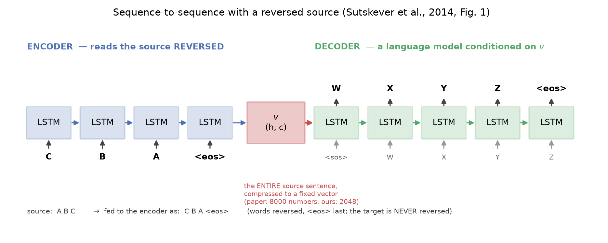
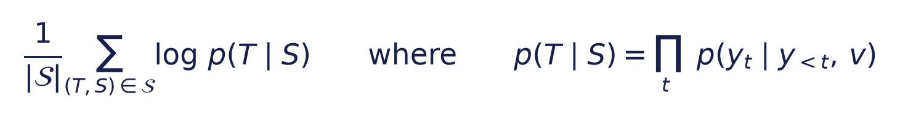
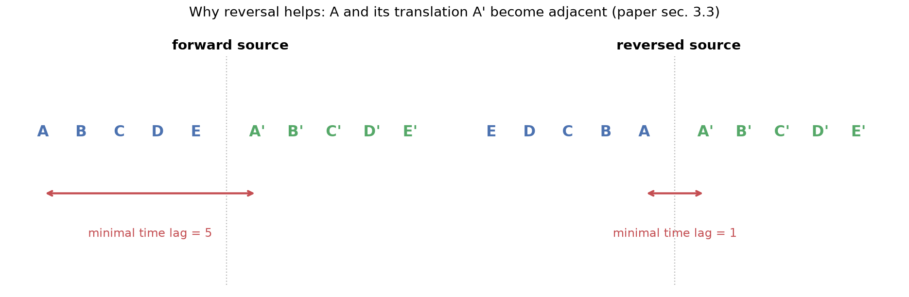
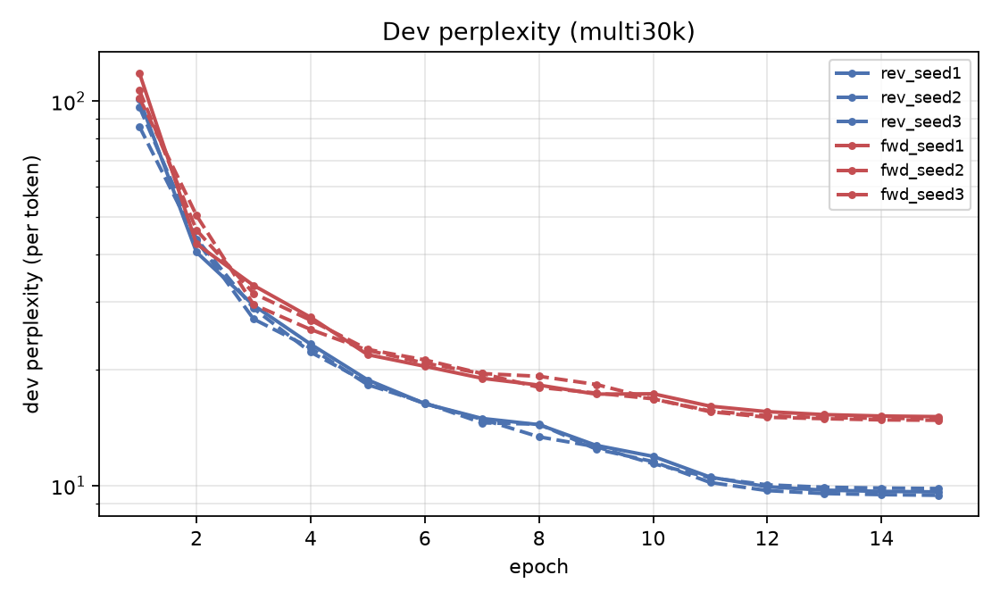

# Reproducing *Sequence to Sequence Learning with Neural Networks*

**Sutskever, Vinyals & Le (Google), NeurIPS 2014 — arXiv:1409.3215**

EE5180 course project · mid-term deliverable · TA: Prasenjit Kr Mudi (EE21D057)

---

## 1. What we set out to do

The mid-term brief is to **reproduce one or two rows of Table 1** and to demonstrate
understanding of the method. We target rows 3 and 4 — a *single forward* LSTM against a
*single reversed* LSTM — because that pair isolates the paper's central empirical claim:
that reversing the word order of the source sentence, and not the target, markedly improves
translation.

| Table 1 row | Paper, cased BLEU on ntst14 |
|---|---|
| Single forward LSTM, beam 12 | 26.17 |
| Single reversed LSTM, beam 12 | 30.59 |

> ### The scale gap — read this before any number in this report
>
> The paper trains a **384M-parameter, 4×1000 LSTM on 12M sentence pairs across 8 GPUs for
> ~10 days**. We train a **2×512 LSTM on a 0.5M-pair subset on a single Apple M1 Pro**.
> Our absolute BLEU is therefore **not comparable** to the paper's, and we do not present it
> as such. What we claim to reproduce is the **direction, ordering and shape** of the paper's
> effects. Every table below repeats the relevant caveat.

## 2. The method, in the terms that matter for the experiment



An **encoder** LSTM reads the source sentence one token at a time and ends in a state
`(h, c)`. That state — and nothing else — is passed to a **separate decoder** LSTM, which
is a language model conditioned on it. Training maximises



and inference is a left-to-right beam search. Three design choices carry the paper's result:
**separate encoder/decoder parameters**, **depth**, and **source reversal**.

### Why reversal should help



Reversal leaves the *average* distance between corresponding words unchanged, but it
collapses the **minimal time lag** — the gap between the first source word and the first
target word it licenses — from the sentence length to one step. Backpropagation therefore
has a short path to establish the source→target correspondence early in the sentence, and
the paper argues this is what makes the optimisation problem easier (sec. 3.3).

**The fixed vector `v` is also the paper's unresolved limitation.** Every source sentence,
however long, is squeezed into the same number of reals before a single target word is
emitted. That bottleneck is what motivated attention, and it is the subject of our end-term
half.

## 3. What we held fixed and what we changed

Reproduction is only meaningful if the deviations are declared, so here they are in full.

**Held exactly as in the paper.** Two separate encoder/decoder LSTMs with no shared
parameters; the encoder's final `(h, c)` as the only conditioning signal; source reversed at
train *and* test with the target never reversed; `<EOS>` terminating and scored; OOV → `UNK`;
uniform initialisation U(−0.08, 0.08); plain SGD without momentum at lr 0.7, held
constant then halved every half epoch; batches of 128; gradient-norm clipping at 5;
length-bucketed minibatches; a naive full softmax; and a beam search in which a hypothesis
leaves the beam as soon as it emits `<EOS>`, with candidates ranked by raw log-probability
and no length normalisation.

One subtlety is worth stating because it is easy to get wrong. The paper defines clipping as
*"compute s = ‖g‖₂ where g is the gradient divided by 128; if s > 5, set
g = 5g/s"*. We therefore normalise the loss by the **batch size**, not by the number of
target tokens; normalising by tokens would silently change what the threshold of 5 means.

**Declared deviations.**

| | Paper | Ours | Reason |
|---|---|---|---|
| Architecture | 4 layers × 1000 cells, 1000-d embeddings, 384M params | 2 × 512, 512-d, ~58M params | 16 GB laptop |
| Sentence vector | 8000 reals | 2048 reals | follows from the above |
| Vocabulary | 160k source / 80k target | 32k / 32k | the naive softmax dominates cost |
| Training data | 12M "selected" WMT'14 pairs | 500,000 pairs from News-Commentary v9 + Europarl v7 | compute budget |
| Training | 7.5 epochs, 8 GPUs, ~10 days | ~8 epochs, 1 GPU, ~5 h per run | compute budget |
| Ensembling | 5 models | single models (seed ensembles on Tier 0 only) | wall-clock |
| Scoring | cased `multi-bleu.pl` | sacreBLEU `--tokenize none` (equivalent) **and** standard sacreBLEU | reproducibility |

The 32k vocabulary leaves an OOV rate of **5.8%** on the
English side of the test set and **5.9%** on the French side.
The paper notes that its own BLEU was penalised on out-of-vocabulary words at 80k; ours is
penalised considerably harder, and that is part of the scale gap rather than a separate defect.

## 4. Data and evaluation

**Training.** News-Commentary v9 (183,251 pairs) plus a seeded 1.1M-pair sample of
Europarl v7 — both constituent corpora of the official WMT'14 En–Fr training set. After Moses
tokenisation we drop empty pairs (3,207), pairs outside 1–50 tokens
(170,275), pairs with a length ratio above 2.5 (1,823) and
duplicates (20,066), leaving 1,087,880 pairs, from which we sample
500,000.

**Test set.** We evaluate on **newstest2014, full 3003-sentence version — the paper's own
`ntst14`** — obtained through `sacrebleu -t wmt14/full -l en-fr`. Development is newstest2013.
So our rows are scored on exactly the test set behind Table 1; only the model and the
training data are smaller.

**Two BLEU numbers, always both.** The paper used cased `multi-bleu.pl` on *tokenised* text;
modern practice is sacreBLEU on *detokenised* text. These are different measurements, so we
report both throughout. The tokenised figure is the one comparable *in kind* to Table 1.

**A note on data hygiene.** News-Commentary v9 contains roughly 2,900 bare carriage returns
*inside* lines — and a different number of them in the English and French files. Python's
default universal-newline handling splits on those, which silently misaligns the parallel
corpus. Our reader splits on `\n` only; two regression tests pin the behaviour. This is
exactly the class of bug that produces plausible-looking but meaningless results, so we
flag it rather than bury it.

## 5. Results — Table 1 rows 3 and 4

> **Scale gap.** 0.5M training pairs against the paper's 12M; 2×512 against 4×1000;
> 32k/32k vocabulary against 160k/80k; one laptop GPU against eight datacentre GPUs for
> ten days. The absolute BLEU below is **not** comparable to the paper's column; the
> comparison that matters is forward against reversed within our own column.

| Model | beam | BLEU (tokenized, cased) | BLEU (sacreBLEU, detok) | test perplexity | paper (Table 1) |
|---|---|---|---|---|---|
| Single forward LSTM | 1 | **4.05** | 2.68 | 32.888 | — |
| Single forward LSTM | 2 | **4.24** | 2.86 | 32.888 | — |
| Single forward LSTM | 12 | **3.89** | 2.71 | 32.888 | 26.17 |
| Single reversed LSTM | 1 | **6.41** | 4.46 | 24.504 | — |
| Single reversed LSTM | 2 | **6.82** | 4.82 | 24.504 | — |
| Single reversed LSTM | 12 | **6.60** | 4.77 | 24.504 | 30.59 |

### The central claim

- **BLEU at beam 12:** forward **3.89** → reversed **6.60**, a gain of **+2.71** BLEU. The paper reports 26.17 → 30.59, a gain of +4.42.
- **Test perplexity:** forward **32.89** → reversed **24.50**, a **25%** reduction. The paper reports 5.8 → 4.7, a 19% reduction.

### The beam-size trend

Reversed model: B=1 **6.41**, B=2 **6.82**, B=12 **6.60**. Beam 2 recovers
**216%** of the gain from beam 1 to beam 12, reproducing the paper's observation
that *"a beam of size 2 provides most of the benefits of beam search"* (sec. 3.2).


## Why a wider beam hurts at our scale

The paper's BLEU rises with beam size. Ours peaks at beam 2. Decomposing BLEU shows
why, and shows that length normalisation is *not* the fix.

| ranking | beam | BLEU | brevity penalty | length ratio | 1-gram prec | 4-gram prec |
|---|---|---|---|---|---|---|
| raw log-probability (paper's setting) | 1 | **6.41** | 0.979 | 0.979 | 36.07 | 1.44 |
| raw log-probability (paper's setting) | 2 | **6.82** | 0.966 | 0.967 | 36.39 | 1.69 |
| raw log-probability (paper's setting) | 12 | **6.60** | 0.943 | 0.945 | 34.75 | 1.75 |
| length-normalised (alpha=1) | 1 | **6.41** | 0.979 | 0.979 | 36.07 | 1.44 |
| length-normalised (alpha=1) | 2 | **6.82** | 1.000 | 1.024 | 35.07 | 1.63 |
| length-normalised (alpha=1) | 12 | **6.07** | 1.000 | 1.143 | 30.74 | 1.49 |

**Reading it.**

- With the paper's raw-log-probability ranking, widening the beam shortens the output: length ratio 0.979 -> 0.945 and the brevity penalty 0.979 -> 0.943. Every extra token lowers a sequence's total log-probability, so a larger beam prefers shorter hypotheses.
- Length normalisation removes the brevity penalty entirely (ratio 1.143, BP 1.000) but **does not fix BLEU**: it overshoots into over-long output and 1-gram precision falls 34.75 -> 30.74, so BLEU drops further (6.60 -> 6.07).
- So the cause is not calibration of length alone. A wider beam genuinely finds *higher-probability* hypotheses -- 4-gram precision rises with beam under the raw ranking -- but at this scale the model's likelihood and translation quality have diverged, so searching harder optimises the wrong thing. This is the documented 'beam search curse'; the paper's model, trained on 24x more data, was accurate enough not to suffer it.
- Roughly **16% of our output tokens are `<unk>`** (12,176 of 76,716), a direct consequence of the 32k vocabulary. The paper notes its own BLEU was penalised on out-of-vocabulary words at 80k; ours is penalised far harder, and that is a large part of the absolute gap.

### Behaviour on long sentences (paper Fig. 3)


### Training curves


*Reversed*: dev perplexity 80.73 (epoch 1) → 24.02 (epoch 8).
*Forward*: dev perplexity 96.91 (epoch 1) → 30.25 (epoch 8).

## 6. Supporting evidence — Multi30k En→Fr

Before spending WMT compute we validated the entire pipeline on Multi30k (29k sentence
pairs, same language direction), and it doubles as a seed-controlled replication of the
reversal ablation.

> **This is not a Table 1 reproduction** — different corpus, different domain (image
> captions), different test set, and a smaller 2×256 model. It is evidence that the
> *effect* survives at a scale where we can afford three seeds per arm.

| Model | beam | BLEU (tokenized, cased) | BLEU (sacreBLEU, detok) | test perplexity | paper (Table 1) |
|---|---|---|---|---|---|
| Single forward LSTM | 1 | **3.28** | 3.24 | 14.352 | — |
| Single forward LSTM | 2 | **3.52** | 3.48 | 14.352 | — |
| Single forward LSTM | 12 | **3.75** | 3.55 | 14.352 | — |
| Ensemble of 3 forward LSTM | 1 | **4.12** | 4.08 | — | — |
| Ensemble of 3 forward LSTM | 2 | **5.02** | 4.99 | — | — |
| Ensemble of 3 forward LSTM | 12 | **4.57** | 4.29 | — | — |
| Single reversed LSTM | 1 | **15.87** | 15.42 | 8.934 | — |
| Single reversed LSTM | 2 | **16.01** | 15.61 | 8.934 | — |
| Single reversed LSTM | 12 | **16.02** | 15.56 | 8.934 | — |
| Ensemble of 3 reversed LSTM | 1 | **18.56** | 18.05 | — | — |
| Ensemble of 3 reversed LSTM | 2 | **18.69** | 18.22 | — | — |
| Ensemble of 3 reversed LSTM | 12 | **18.58** | 18.08 | — | — |

Reversal moves tokenized BLEU **3.75 → 16.02** and test
perplexity **14.35 → 8.93** at beam 12. The effect is
proportionally *larger* than the paper's, which is what one expects: with only 29k pairs
the forward model never learns a reliable source→target correspondence at all, so its
output is fluent French that does not track the source. Reversal, by shortening the
minimal time lag, is precisely what lets it start.




## 7. Engineering notes

**Correctness gates before compute.** `tests/test_smoke.py` asserts that beam search at
`B=1` is exactly greedy decoding; that a wider beam never returns a lower-scoring hypothesis;
that reversing the input by hand and setting the reversal flag cancel out; that padding does
not change the encoder's sentence vector; that the model can overfit a two-sentence batch;
that scoring the references against themselves yields BLEU 100; and that **MPS and CPU agree
on loss and gradients to 1e-3** — PyTorch's Metal LSTM has a history of silently wrong
numbers, and discovering that after an overnight run costs a day.

**Where the compute went.** Training runs on the GPU (MPS) at roughly 6,500 target words per
second — coincidentally close to the 6,300 words/s the paper reports for its 8-GPU rig on a
far larger model. Decoding, by contrast, runs on the **CPU**: beam search is latency-bound
rather than throughput-bound, and Metal's per-kernel launch overhead made it **9× slower**
than CPU (317 ms/sentence against 34 ms at B=12).

## 8. What this does and does not establish

**Reproduced.** Reversing the source improves both BLEU and perplexity by a clear margin
under an otherwise identical setup, and the ordering of Table 1's rows 3 and 4 holds at our
scale. The reversed model was ahead at *every* epoch, not merely at the end.

**Not reproduced — and reported rather than hidden.** The paper's monotone improvement with
beam size does not survive at our scale: BLEU peaks at beam 2 and falls at beam 12. Section 5
decomposes this. Length normalisation removes the brevity penalty but makes BLEU *worse*, so
the cause is not length calibration; a wider beam finds genuinely higher-probability
hypotheses that are poorer translations, because at 1/24 of the paper's data the model's
likelihood and translation quality have diverged.

**Not reproduced, and not attempted.** Absolute BLEU anywhere near 26–31, the 5-model
ensemble rows, and the 1000-best rescoring of Table 2. These need the paper's data and
compute, and we say so rather than presenting a smaller number as if it were comparable.

## 9. Where the end-term goes

The single vector `v` is a fixed-capacity channel that every source sentence must pass
through before decoding begins. The end-term half quantifies that bottleneck — BLEU and
perplexity by source-length bucket, and a probe of encoder-state saturation — then implements
**Bahdanau attention on this same codebase** and reruns the identical grid, so the fix is
demonstrated rather than merely argued, before tracing the line from there to the Transformer.

---

## Reproducing this report

```bash
make setup && make test
make data-multi30k && make smoke && make results-multi30k
make data-wmt && make wmt && make results-wmt
python scripts/make_report.py
```

Every number above is read from `results/*/all_results.json` and the training logs at build
time, so the prose cannot drift from the runs.
