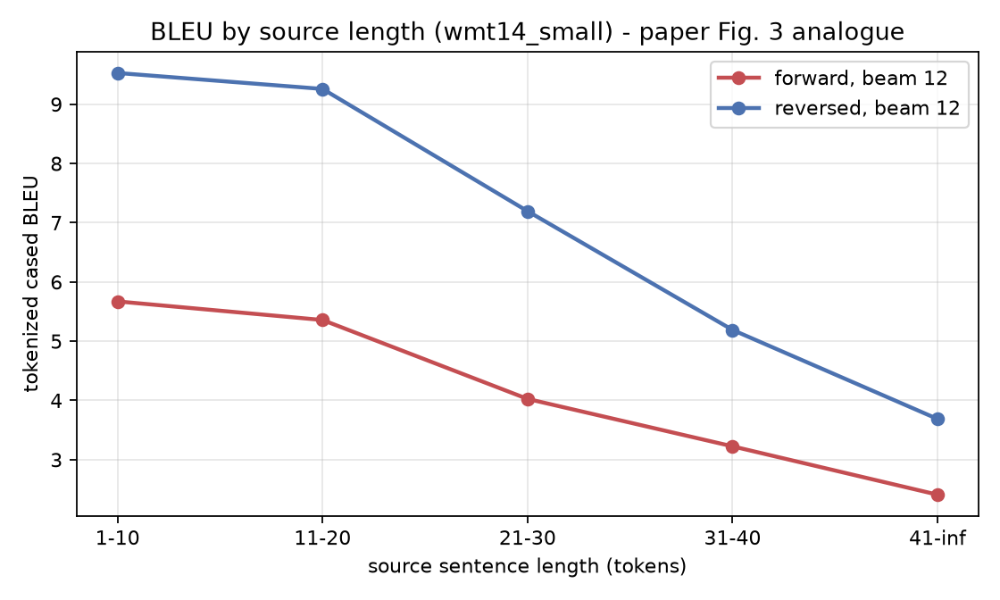
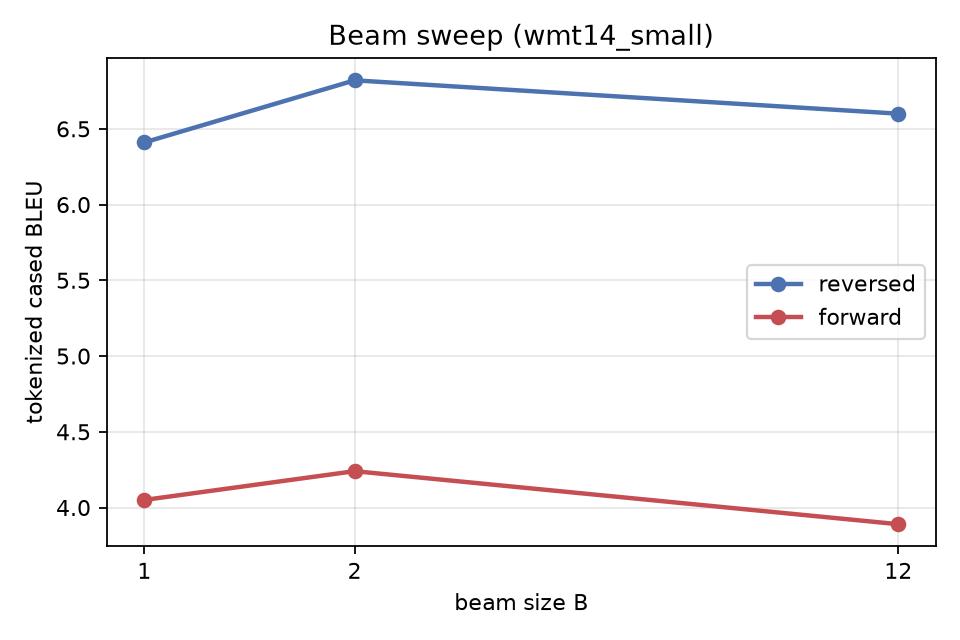
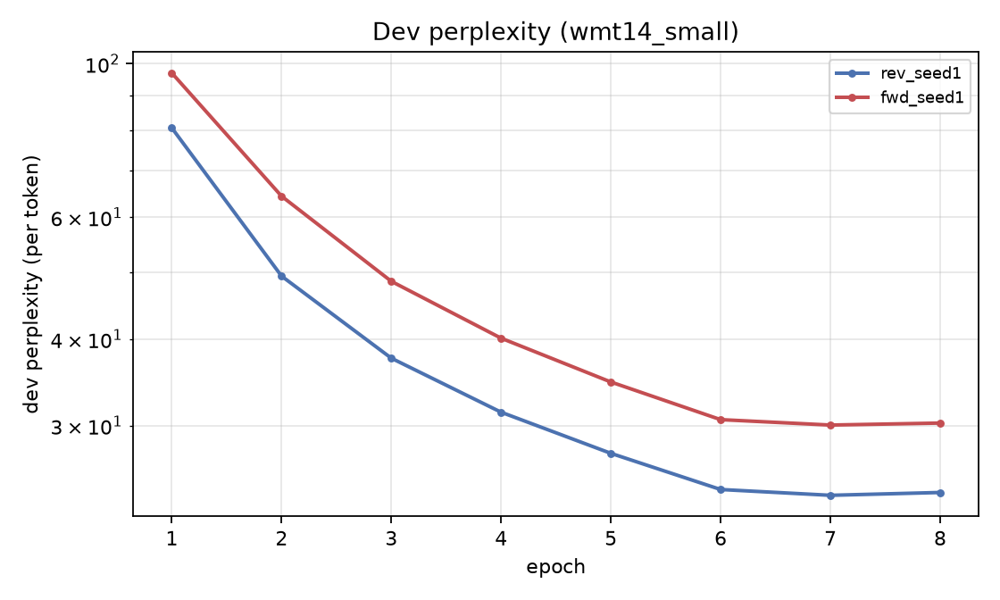

# Reproduction results - wmt14_small

> **Scale gap.** 0.5M training pairs vs the paper's 12M; 2x512 vs 4x1000; 32k/32k vocab vs 160k/80k; ~8 epochs on one M1 Pro GPU vs 7.5 epochs on 8 GPUs for 10 days. Absolute BLEU is NOT comparable to Table 1 - the direction and shape of the effects are.

| Method | beam | our BLEU (tok, cased) | our BLEU (sacreBLEU detok) | our test ppl | paper BLEU |
|---|---|---|---|---|---|
| Single forward LSTM | 1 | **4.05** | 2.68 | 32.888 | - |
| Single forward LSTM | 2 | **4.24** | 2.86 | 32.888 | - |
| Single forward LSTM | 12 | **3.89** | 2.71 | 32.888 | 26.17 |
| Single reversed LSTM | 1 | **6.41** | 4.46 | 24.504 | - |
| Single reversed LSTM | 2 | **6.82** | 4.82 | 24.504 | - |
| Single reversed LSTM | 12 | **6.60** | 4.77 | 24.504 | 30.59 |

## The paper's central claim, at our scale

- BLEU (beam 12): forward **3.89** -> reversed **6.60** (**+2.71**); paper 26.17 -> 30.59 (+4.42).
- Test perplexity: forward **32.888** -> reversed **24.504**; paper 5.8 -> 4.7.
- Beam: B=1 6.41, B=2 6.82, B=12 6.60 - BLEU peaks at B=2 and falls by 0.22 at B=12, so the paper's monotone beam trend does NOT reproduce at our scale. A wider beam does find higher-probability hypotheses, but they are worse translations. Length normalisation removes the brevity penalty and makes BLEU worse still, so brevity is a symptom rather than the cause - see beam_ablation.md for the decomposition.

## Figures

## Scoring signatures

- tokenized (multi-bleu.pl equivalent): `nrefs:1|case:mixed|eff:no|tok:none|smooth:exp|version:2.6.0`
- detokenized sacreBLEU: `nrefs:1|case:mixed|eff:no|tok:13a|smooth:exp|version:2.6.0`
